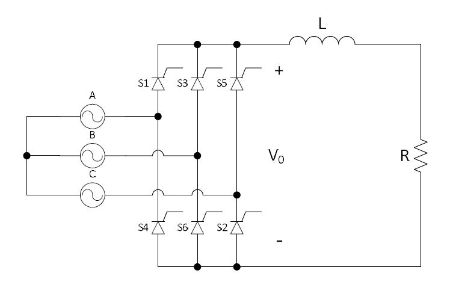
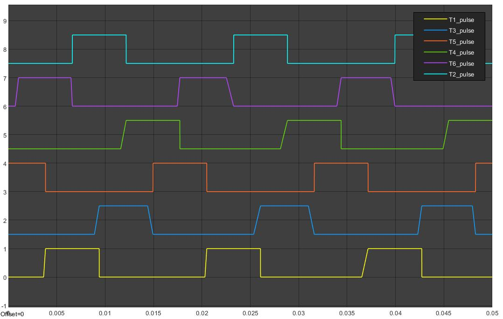

# Three-phase phase-controlled full-wave rectifier with RL load (MATLAB Simulink)
## Contents:
1) **three-phase-full-wave-rectifier.slx** - Simulink Model
2) **IEEE_format_paper.pdf** - Descriptive paper about the development of the project in IEEE format
3) **Project_presentation.pdf** - Presentation for th project

This project is a simulation of the three-phase phase-controlled full-wave rectifier in Simulink. The general configuration for the controlled threephase
rectifier is shown on the figure below

Pulses generated for siz thyristors are as follows:

